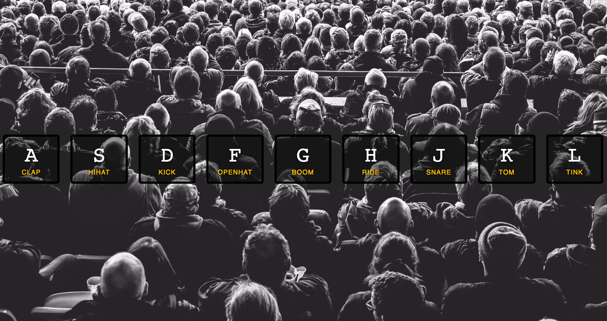

> This is a JavaScript practice with [JavaScript30](https://javascript30.com/) by [Wes Bos](https://github.com/wesbos) without any frameworks, no compilers, no boilerplate, and no libraries.

# 01 - Drum Kit
key event listener, audio play and toggle class.



view demo [here](https://amelieyeh.github.io/JS30/01-JSDrumKit/index.html)

### Bind an event to our keys when they are pressed.

`window.addEventListener('keydown', playSound)`

- `playSound()` is a listener for `keydown` events registered using `window.addEventListener`.
- `window` is the global object in a browser, or the root object of the DOM. And  `document` stands for DOM.

### `data-key` has its own value on `<div>`s and `<audio>`s in HTML

```
const audio = document.querySelector(`audio[data-key="${e.keyCode}"]`);
const key = document.querySelector(`div[data-key="${e.keyCode}"]`);
```

- `keyCode` property is the *KEY* to connect our buttons(`<div>`s) and sounds(`<audio>`s).
- `keyCode` 's value is same as `ASCII` code (in lowercase letter ), check keycodes [here](http://keycode.info/).
- `data-key` is set for mapping buttons and audios to get the `keyCode`s via `keydown` event.
- the whole `querySelector` expression has to be in back ticks (```).
- `${}` is syntactic sugar for template literals, read more about `Expression interpolation` [here](https://developer.mozilla.org/en-US/docs/Web/JavaScript/Reference/Template_literals)

### About playing sounds

How do we prevent delay playing sound, if we keep hitting a key?

just add `audio.currentTime = 0;` before `audio.play();`

### Toggling styles

- use `item.classList.add('className')` to add class when key pressed. (same as `element.addClass('className')` in jQuery)

- use `transitionend` event to remove `play` class. since we want to just remove `transform` property, so add a condition to skip others.

```
if(e.propertyName != 'transform') return;
this.classList.remove('playing'); // `event.target.classList.remove('playing');`
```

### forEach and Arrow function

- `items.forEach()` instead of just `forEach`, which means it's a property of an array.

- Arrow functions is ES6 syntax,

```
keys.forEach(key => key.addEventListener());
```

