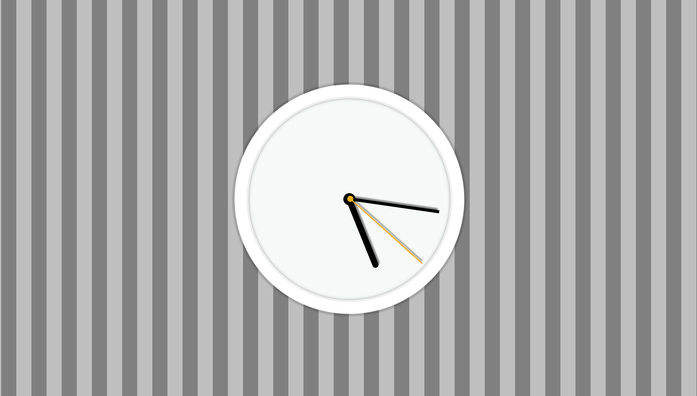

> This is a JavaScript practice with [JavaScript30](https://javascript30.com/) by [Wes Bos](https://github.com/wesbos) without any frameworks, no compilers, no boilerplate, and no libraries.

# 02 - JS + CSS Clock
pointers rotate animation, get times, changing pointer positions.



view demo [here](https://amelieyeh.github.io/JS30/02-JS+CSSClock/index.html)

### Initialize pointer positions and rotation along the x-axis

`transform-origin: 100%; // transform-origin: right;`

`transition-timing-function: cubic-bezier();`

- `transform-origin` moves the origin of rotation along x-axis. check it [here](https://developer.mozilla.org/en-US/docs/Web/CSS/transform-origin).

- `transition-timing-function` here is for the real clock **tic-tock**-like effect.

### Get time

`setInterval(setDate, 1000);`

- the `setInterval` function runs a function passed to it every interval specified which to implement the second pointer's rotating effect.

- create `Date()` to get `now.getSeconds()`, `now.getMinutes()` and `now.getHours()`.

- culculating angles of pointers

`const secondDegrees = ((seconds / 60) * 360) + 90;`

(the initial state of pointers are 90 degrees)

### Wait...is that a glitch!?

Due to there is a glitch that occurs at every 0th second and our transition is set at 0.05s. When hand transition from final state to initial state, because the number of degrees reduce, the hand makes a (reverse) anti-clockwise motion to reach the 0 degree mark, so we'll see it occurs.

To bypass it, we remove the `transition` property at the specified degrees (where glitch occurs) via JavaScript.

```
if (secondsDegrees === 90) secondHand.style.transition = 'all 0s';
else secondHand.style.transition = 'all 0.05s';

if (minsDegrees === 90) minHand.style.transition = 'all 0s';
else minHand.style.transition = 'all 0.1s';
```
