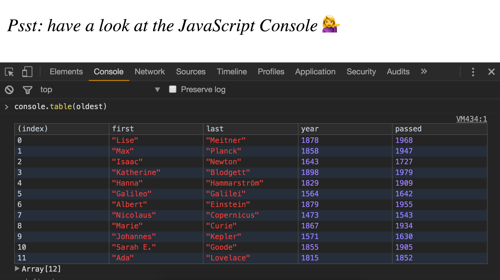

> This is a JavaScript practice with [JavaScript30](https://javascript30.com/) by [Wes Bos](https://github.com/wesbos) without any frameworks, no compilers, no boilerplate, and no libraries.

# 04 - Array cardio day 1



view demo [here](https://amelieyeh.github.io/JS30/04-Array%20cardio%20day%201/index.html)

`console.table()`, `filter()`, `map()`, `sort()`, `reduce()`

### filter

[`Array.prototype.filter()`](https://developer.mozilla.org/en-US/docs/Web/JavaScript/Reference/Global_Objects/Array/filter) creates a new array with all elements that pass the test implemented by the provided function.

- here I learned a compact way to return a value instead of an if-statement returning `true`.

```
const fifteens = inventors.filter(inventor => (inventor.year >= 1500 && inventor.year < 1600));
```

- and I also learned about `console.table()` instead of `console.log()` to display result pretty.

### map

[`Array.prototype.map()`](https://developer.mozilla.org/en-US/docs/Web/JavaScript/Reference/Global_Objects/Array/map) creates a new array with the results of calling a provided function on every element in this array. (takes in an array, and modifies it and returns a new array)

- use `+` for concatenation in JS.

```
const fullNames = inventors.map(inventor => inventor.first + ' ' + inventor.last);
```

above code in a ES6 syntax way:

```
const fullNames = inventors.map(inventor => `${inventor.first} ${inventor.last}`);
```

see, you don't event need to use `+` for concatenation!

### sort

[`Array.prototype.sort()`](https://developer.mozilla.org/en-US/docs/Web/JavaScript/Reference/Global_Objects/Array/sort) sorts the elements of an array *in place* and returns the array.

- the default sort order is according to string Unicode code points.

- `sort()` also accepts the specific function that defines the sort order.

```
const ordered = inventors.sort((a, b) => (a.year > b.year) ? 1 : -1);
```

in this case, we can also write it more shortly for an **ascending order** just like:

```
const ordered = inventors.sort((a, b) => a.year - b.year);
```

### combination of filter and map

```
const de = links
           .map(link => link.textContent)
           .filter(streetName => streetName.includes('de'));
```
- **[NOTICE]**: since `nodeList` is **NOT** an `array`, so we need to turn it into an array first for manipulate array methods.

```
const links = Array.from(document.querySelectorAll('.mw-category a'));
```

above code can rewrite into ES6 syntax like:

```
const links = [...(document.querySelectorAll('.mw-category a'))];
```

### reduce

[`Array.prototype.reduce()`](https://developer.mozilla.org/en-US/docs/Web/JavaScript/Reference/Global_Objects/Array/Reduce) method applies a function against an accumulator and each value of the array(from left-to-right) to reduce it to a single value.

```
const transportation = data.reduce(function(obj, item) {
  if(!obj[item]) {
    obj[item] = 0;
  }
  obj[item] ++;
  return obj;
}, {});
```

`obj` is an element passed in to the `reduce()` function which will gather data over each iteration. and the result is just reduced the "numbers" collection into the "total" variables. which means every time you find yourself going from a list of values to one value (reducing), then you can use this method.

```
const sum = [0, 1, 2, 3, 4].reduce((a, b) => a + b, 0);

console.log(sum);  // 10
```

