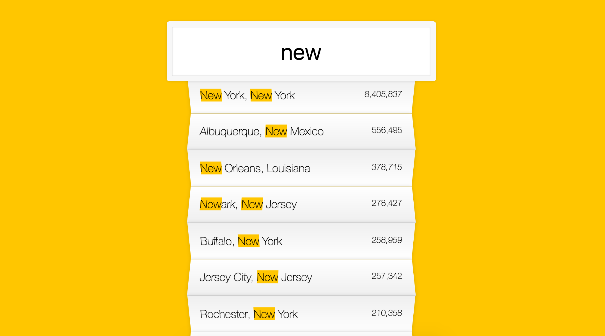
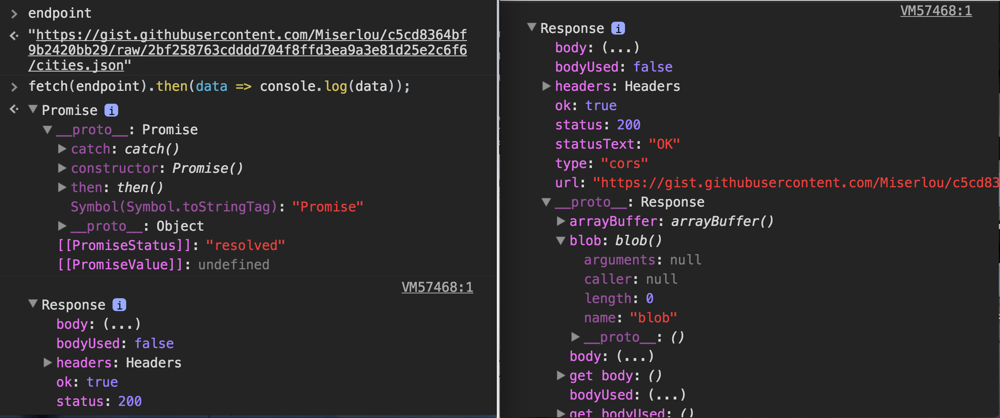

> This is a JavaScript practice with [JavaScript30](https://javascript30.com/) by [Wes Bos](https://github.com/wesbos) without any frameworks, no compilers, no boilerplate, and no libraries.

# 06 - Ajax Type Ahead



view demo [here](https://amelieyeh.github.io/JS30/06-Ajax%20Type%20Ahead/index.html)

- `change` & `keyup` events
- Promise: `fetch()`, `then()`, `json()`
- Array: `filter()`, `map()`, `push()`, `join()`
- Regexp: `match()`, `replace()`

### `change` & `keyup` events

`change` can also be an event in `addEventListener` for inputs, but the `change` only fires when we step outside that input. so we need to tie the element up with the `keyup` event as well. for better user experience.

```
searchInput.addEventListener('change', displayMatches);
searchInput.addEventListener('keyup', displayMatches);
```

### Fetch API

[Fetch API](https://developer.mozilla.org/en-US/docs/Web/API/Fetch_API) provides an interface for fetching resources(including across the network). It will seem familiar to anyone who has used [XMLHttpRequest](https://developer.mozilla.org/en-US/docs/Web/API/XMLHttpRequest), but the new API provides a more powerful and flexible feature set.

[fetch()](https://developer.mozilla.org/en-US/docs/Web/API/WindowOrWorkerGlobalScope/fetch) is one of GlobalFetch API method used to start the process of fetching a resource.

```
fetch(input, init).then(function(response) {...});
```

in [MDN's basic fetch example](https://developer.mozilla.org/en-US/docs/Web/API/GlobalFetch)(see `Examples` section) like:

```
var myImage = document.querySelector('.my-image');

fetch('flowers.jpg')
  .then(function(response) {
    if (!response.ok) return new Error(response);
    return response.blob();
  })
  .then(function(myBlob) {
    var objectURL = URL.createObjectURL(myBlob);
    myImage.src = objectURL;
  })
```

in ES6 syntax will be like:

```
const myImage = document.querySelector('img');

fetch('flowers.jpg')
  .then(response => response.blob())
  .then(myBlob => {
    const objectURL = URL.createObjectURL(myblob);
    myImage.src = objectURL;
  });
```

above example shows that it use the `blob()` to fetch image. and there are many other ways as well. we use `json()` it this case.



### ES6 Spread syntax

[Spread syntax](https://developer.mozilla.org/en-US/docs/Web/JavaScript/Reference/Operators/Spread_operator) allows an expression to be expanded in places where multiple arguments(for function calls) or multiple elements(for array literals) or multiple variables(for destructing assignment) are expected.

For function calls:

```
myFunction(...iterableObj);
```

For array literals:

```
[...iterableObj, 4, 5, 6]
```

usually, we use [`Function.prototype.apply`](https://developer.mozilla.org/en-US/docs/Web/JavaScript/Reference/Global_Objects/Function/apply) in cases like:

```
function myFunction(x, y, z) {}
var args = [0, 1, 2];
myFunction.apply(null, args);
```

but in ES6 we can now write the above as:

```
function myFunction(x, y, z) {}
var args = [0, 1, 2];
myFunction(...args);
```

### RegExp

```
const regex = new RegExp(wordToMatch, 'gi');
```

`g` is for **global** and `i` is for **case insensitive**,
  `wordToMatch` is our variable, then do `element.match(regex)` or `element.replace(regex)`.

in RegExp, the `match()` executes for matching what we search, and then combine with `Array.filter()` so that we can filter out all the results that we exepect.

