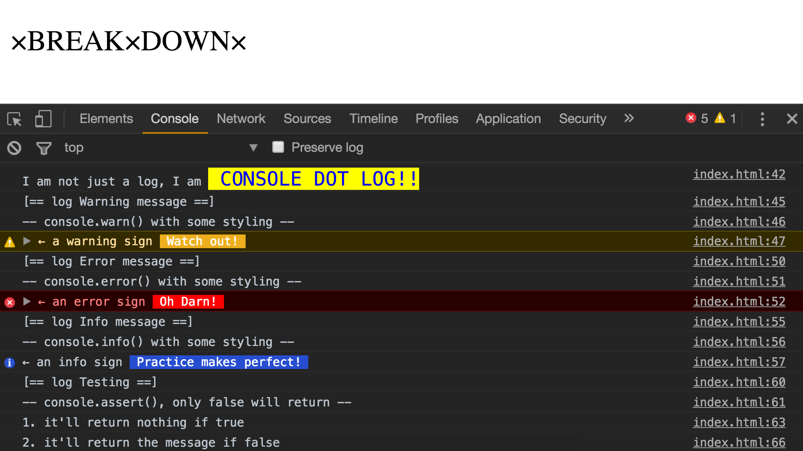
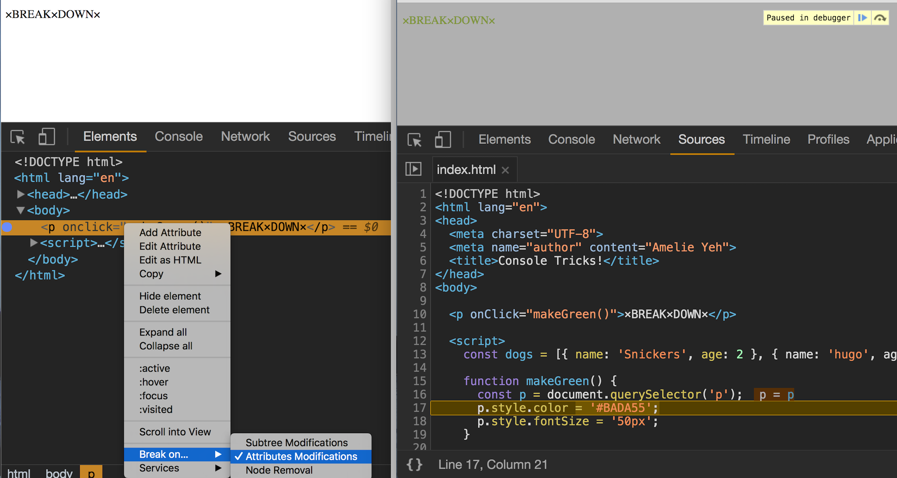
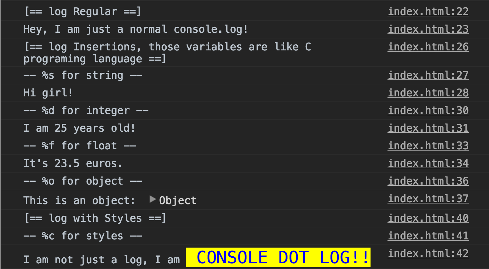
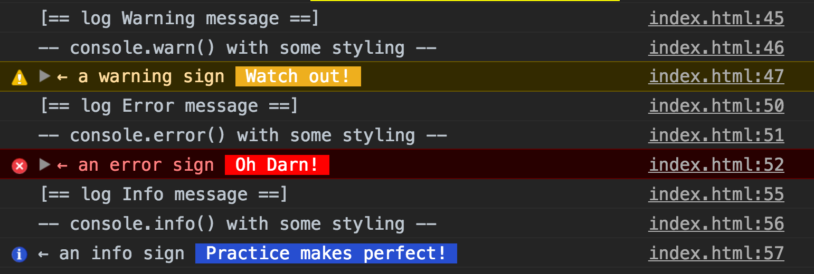
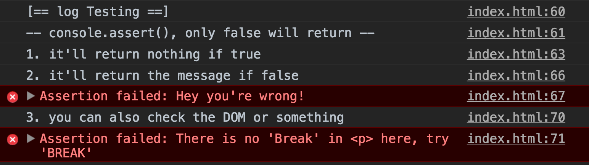
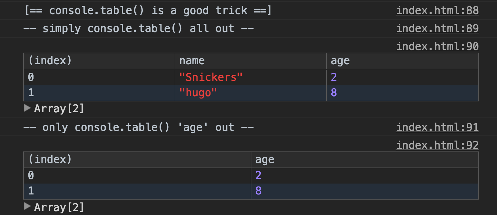
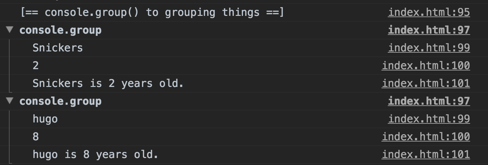
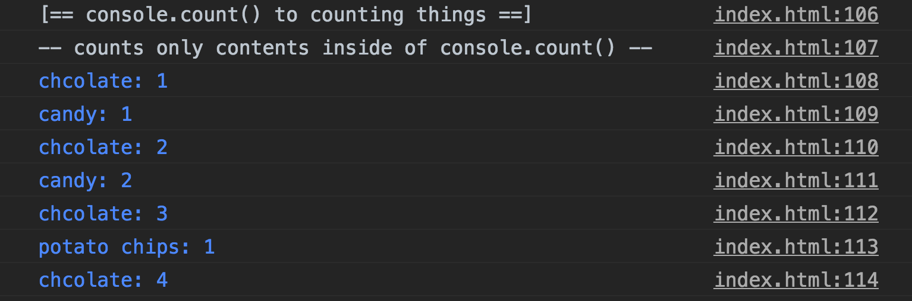
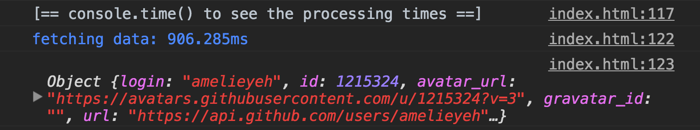
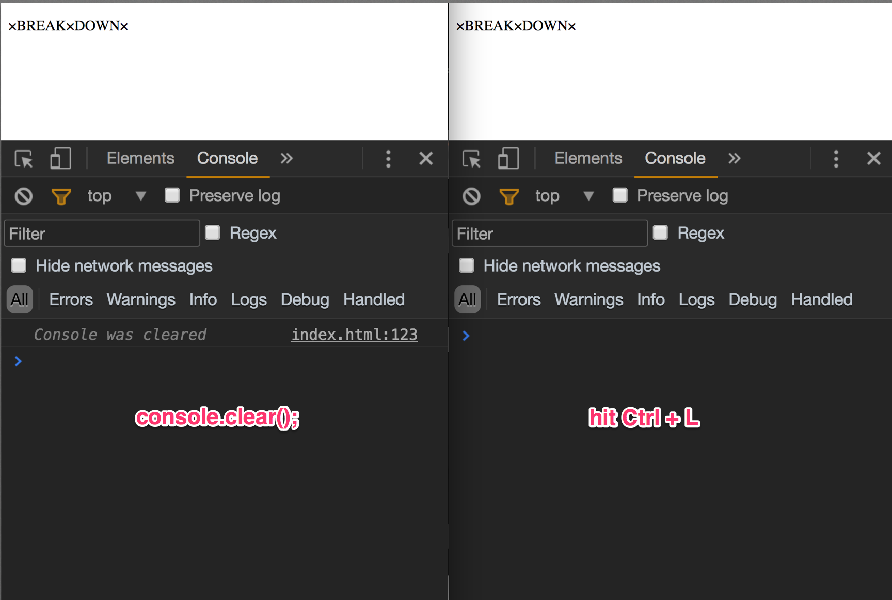

> This is a JavaScript practice with [JavaScript30](https://javascript30.com/) by [Wes Bos](https://github.com/wesbos) without any frameworks, no compilers, no boilerplate, and no libraries.

# 09 - Dev Tools Domination



view demo [here](https://amelieyeh.github.io/JS30/09-Dev%20Tools%20Domination/index.html)

`Attributes Modification` on an element and bunch of `console` tricks

### Attributes Modification

Making a break point to see what's going on to the element.



### Dominating the `console` tricks

- more `console.log`
  - most commonly used `console.log();`
  - but it can be more ways of Interpolation like C programing language with:
    - `%s`: string

      `console.log("Hi %s!", "girl"); // Hi girl!`

    - `%d`: integer

      `console.log("I am %d years old!", 25);  // I am 25 years old!`
    - `%f`: float

      `console.log("It's %f euros.", 23.5);  // It's 23.5 euros.`

    - `%o`: object

      `console.log("This is an object:  %o", {firstName: 'Amber', lastName: 'Simpson', age: 20});`

    - `%c`: for styled
      `console.log("I am not just a log, I am %c CONSOLE DOT LOG!!", "font-size: 18px;color: blue;background-color: yellow");`



- defaults of `console.log`
  - `console.warn` for warning message

    `console.warn("← a warning sign %c Watch out! ", "background-color: #eeaf1e;color: #fff");`

  - `console.error` for error message

    `console.error("← an error sign %c Oh Darn! ", "background-color: red;color: #fff");`

  - `console.info` for info message

    `console.info("← an info sign %c Practice makes perfect! ", "background-color: #274ed0;color: #fff");`



- Testing with `assert()`
  - nothing returns if true

    `console.assert(1 === 1, "Hey it\'s true"); // nothing returns`

  - returns the second argument if false

    `console.assert(1 === 0, "Hey you\'re wrong!"); // Hey your're wrong!`

  - using `assert()` to check DOM element

    ```
    const p = document.querySelector('p');
    console.log("3. you can also check the DOM or something");
    console.assert(p.innerHTML.match('Break'), "There is no \'Break\' in <p> here, try \'BREAK\'");
    ```



- Viewing DOM elements
  - `document.querySelector()` an element first
  - log out only a DOM tag of the element

    `console.log(p);`

  - use `console.dir()` to view the properties of the element

    `console.dir(p);`


- Log out something tidy with console.table()
  - simply `console.table()` all out

    `console.table(dogs);`

  - `console.table()` specified things out

    `console.table(dogs, ['age']);`



- Grouping together

`group()`/`groupCollapsed` and `groupEnd()` will automatically grouping thins up

  ```
  const dogs = [{ name: 'Snickers', age: 2 }, { name: 'hugo', age: 8 }];
  dogs.forEach(dog => {
    console.group();                // open up the group
    // console.groupCollapsed();    // close up the group
    console.log(`${dog.name}`);
    console.log(`${dog.age}`);
    console.log(`${dog.name} is ${dog.age} years old.`);
    console.groupEnd();
  });
  ```



- Counting things

counts only contents inside of `console.count()`

  ```
  console.count("chcolate");
  console.count("candy");
  console.count("chcolate");
  console.count("candy");
  console.count("chcolate");
  console.count("potato chips");
  console.count("chcolate");
  ```



- Processing times

`time('name')` controls the start point and `timeEnd('name')` controls the end point, the `'name'` variables are what we define and must be the same.

```
console.time('fetching data');
fetch('http://api.github.com/users/amelieyeh')
  .then(data => data.json())
  .then(data => {
    console.timeEnd('fetching data');
    console.log(data);
  });
```



### Clearing the console panel

There are two ways to clear the console panel:

- `console.clear();`
- hit `Ctrl + L` (in Chrome)



