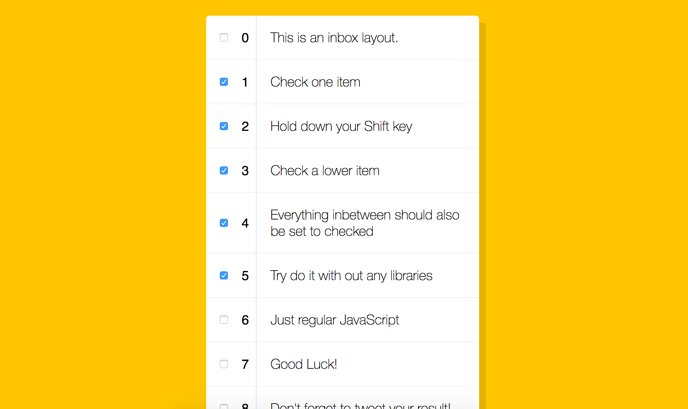
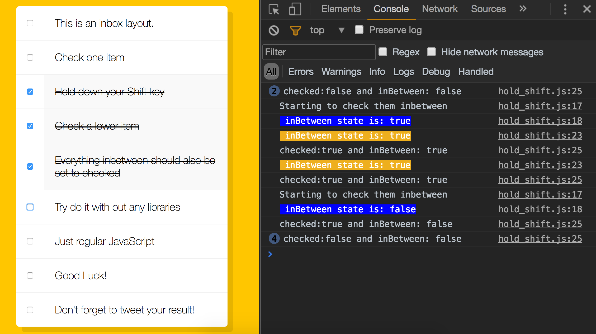
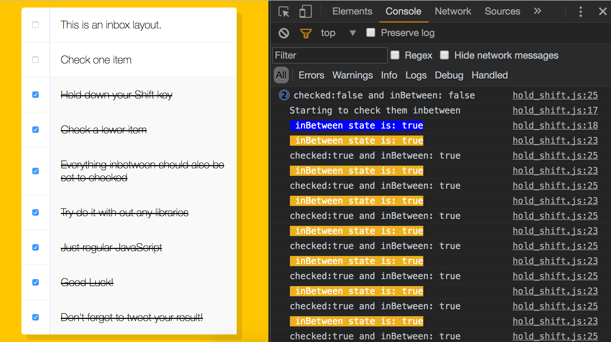
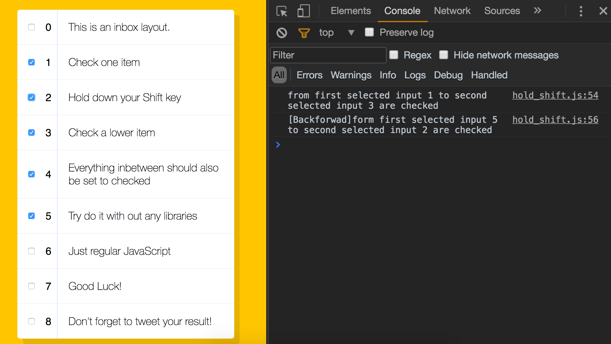

> This is a JavaScript practice with [JavaScript30](https://javascript30.com/) by [Wes Bos](https://github.com/wesbos) without any frameworks, no compilers, no boilerplate, and no libraries.

# 10 - Hold Shift and Check Checkboxes



view demo [here](https://amelieyeh.github.io/JS30/10-Hold%20Shift%20and%20Check%20Checkboxes/index.html)

### Fetch all the `<input>` elements and `addEventListener`

```
const checkboxes = document.querySelectorAll('.inbox input[type="checkbox"]');
checkboxes.forEach(checkbox => checkbox.addEventListener( 'click', handleCheck ));  // `click` also fire when use keyboard
```

### Checking steps

- destructuring steps
  - check an input a <- will be the `lastChecked`
  - hold shift key
  - check an input b <- will be `this`
  - then we want to all the inputs between a and b will also be checked <- `inBetween`'s inputs `.checked = true`;

- in tutorial

```
let lastChecked;

function handleCheck(e) {
  // console.log(e);
  // check if they have shift key down
  // and check that they are checking it
  let inBetween = false;
  if(e.shiftKey && this.checked) {
    // go ahead and do what we please
    // loop over every single checkbox
    checkboxes.forEach(checkbox => {
      console.log(checkbox);
      if(checkbox === this || checkbox === lastChecked) {
        inBetween = !inBetween;
        console.log('Starting to check them inbetween');
      }

      if(inBetween) {
        checkbox.checked = true;
      }
    });
  }

  lastChecked = this;
}
```

 - we defines the range of `inBetween` by `checkbox === this` and `checkbox === lastChecked`

 - checking all inputs, if it's one of the two inputs we checked, then flip the `inBetween = true`, and set all the `inBetween = true` inputs ' `.checked = true`

### Where I got stuck

let's take a look in a pseudo-code way, and I always like to use this way :)

```
let inBetween = false;
// first seleted b, then hold shiftKey and slected d
//start checking
[ ] a  <- inBetween = false, it doesn't event get in the if condition
[v] b  <- inBetween = true, b is the checked input 'lastChecked', and inBetween starts to flip to true
[v] c  <- inBetween = true
[v] d  <- inBetween = false, d is the checked input 'this', and its inBetween is fliped from true to false, then the checking ended as well.
[ ] e  <- inBetween = x, it doesn't get in the if condition
```



I've got stuck in a long time for that iteraling to the input c, how come its `inBetween` is true, seems like it doesn't match either `checkbox === this` or `checkbox === lastChecked`, is beacuse the `inBetween` had fliped to true so that it's true when checking on input c, right ?

hope this way will help you understand much better like I did.

### Let's face to some problems

- problem 1: if you reload page and hold shift key directly, then select one input, the rest of inputs those are after the one you selected will be selected too.
- problem 2: if you shift-selected input b to input d, and then you unselect the input c, then again you hold shift key and select the input c, you'll get the others after input d will be selected too.

I guess the above two problems both are the same logic issues.



The figure above shows the problem 1 result I'd tried, and I think that is because in this case only has a seleted input just right equals the `checkbox === lastChecked` and some how it treat the last input as the `checkbox === this`, so it will iteral over all the rest of inputs (after the one we seleted), and set the `inBetween = true` till the end.

### How to fix it up

Here is one of solutions I found on [stack overflow: How can I shift-select multiple checkboxes like GMail? ](http://stackoverflow.com/questions/659508/how-can-i-shift-select-multiple-checkboxes-like-gmail/659571#659571)

- step 1: turn the NodeList into an Array

```
const checkboxes = document.querySelectorAll('.inbox input[type="checkbox"]');
const checkboxesArray = [...checkboxes]; // fixup-step-1: turn the NodeList into an Array
```

- step 2: when `e.shfitKey` is true, use `array.indexOf()` to get the index of seleted inputs in the array to define the range (say the range containts the start point like `checkbox === lastChecked` and end point like `checkbox === this`)

```
let start = checkboxesArray.indexOf(lastChecked);
let end = checkboxesArray.indexOf(this);
```

- step 3: `let` the `checkState` variable is `false`, it represents the inputs in the range which are checked or not

```
let checkState = false;
```

- step 4: use `array.slice()` to take all the elements between the range and change their `checkState` to checked

```
checkboxesArray
  .slice(Math.min(start, end), Math.max(start, end) + 1)
  .forEach(input => input.checked = checkState);
```

- combine them all together

```
const checkboxes = document.querySelectorAll('.inbox input[type="checkbox"]');
const checkboxesArray = [...checkboxes]; // fixup-step-1

let checkState = false;  // fixup-step-3
function handleCheck(e) {
  if(!lastChecked) { lastChecked = this; }  // mark the lastChecked to redefine the range
  checkState = lastChecked.checked ? true : false;  // checked or unchecked

  if(e.shiftKey) {
    // fixup-step-2
    let start = checkboxesArray.indexOf(lastChecked);
    let end = checkboxesArray.indexOf(this);
    // fixup-step-4
    checkboxesArray
      .slice(Math.min(start, end), Math.max(start, end) + 1)
      .forEach(input => input.checked = checkState);

    if(start - end < 0) {
      console.log(`from first selected input ${start} to second selected input ${end} are checked`);
    } else {
      console.log(`[Backforwad]form first selected input ${start} to second selected input ${end} are checked`);
    }
  }
  lastChecked = this;
}
```



well then...now it seems much better, but I think there are some other tiny problems...

