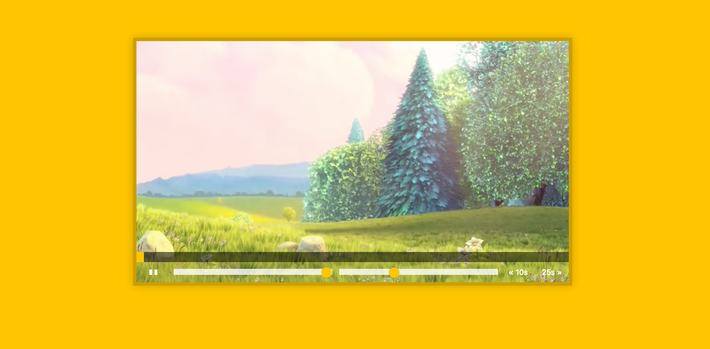
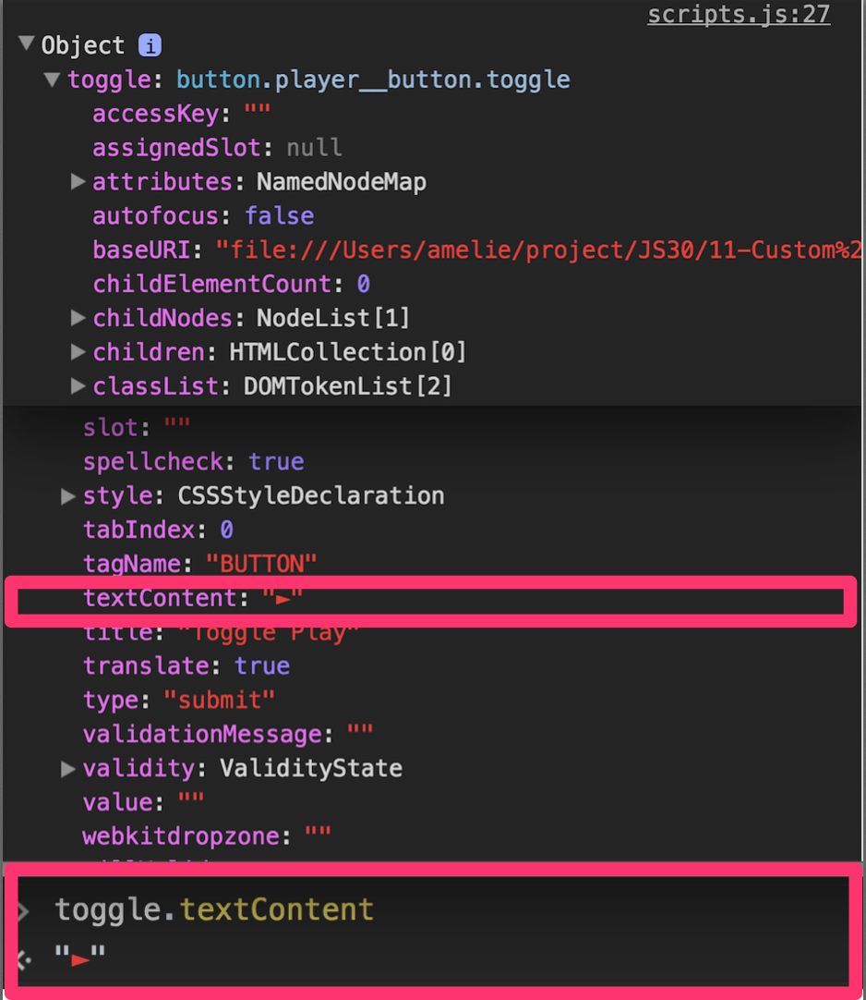
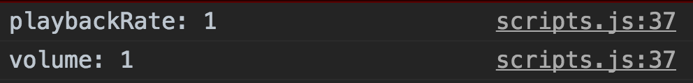

> This is a JavaScript practice with [JavaScript30](https://javascript30.com/) by [Wes Bos](https://github.com/wesbos) without any frameworks, no compilers, no boilerplate, and no libraries.

# 11 - Custom Video Player



view demo [here](https://amelieyeh.github.io/JS30/11-Custom%20Video%20Player/index.html)

`video.paused`, `video.currentTime`, `dataset` of `.data-` attribute, `parseFloat()`

### Get all the elements we need

user `.querySelector` or `.querySelectorAll` to get the elements we need to build up the panel for video player

```
const player = document.querySelector('.player');
const video = document.querySelector('.viewer');
const progress = document.querySelector('.progress');
const progressBar = document.querySelector('.progress__filled');
const toggle = document.querySelector('.toggle');
const skipButtons = document.querySelectorAll('[data-skip]');
const ranges = document.querySelectorAll('.player__slider');
```

### Build out functions

- function togglePlay()
  - click the video to play
  - `.paused` is the property of `video`

  and there is no `.playing` property live on `video`

  ```
  function togglePlay() {
    const method = video.paused ? 'play' : 'pause';
    video[method]();
  }
  ```

  above code equals to:

  ```
  video[vdeo.paused ? 'play' : 'pause']();
  ```

  and

  ```
  if(video.paused) {
    video.play();
  } else {
    video.pause();
  }
  ```

- function updateButton()
  - toggle the play button during the video plays or pauses

  to change icon, in this case is change the `textContent` property

  ```
  const icon = this.paused ? '►' : '❚ ❚';  // `this` is the `video`
  toggle.textContent = icon;
  console.log({toggle});  // log the `{toggle}` out to see where the `textContent` is
  ```

  

- function skip()
  - click the skip buttons to skip

  the two skip buttons are: `<button data-skip="-10"></button>` and `<button data-skip="25"></button>`

  ```
  console.log(this.dataset.skip);
  video.currentTime += parseFloat(this.dataset.skip);
  ```
  `console.log(this.dataset)` can get the information which is the value we just added as `data-skip` attribute on HTML like:

  

  then we use its `skip` property and `parseFloat` into a float number to `-10s` or `+25s`  the `currentTime`

- function handleRangeUpdate()
  - handle the two input sliders

  the two input sliders are: `<input type="range" name="volume">` and `<input type="range" name="playbackRate">`

  ```
  console.log(`${this.name}: ${this.value}`);
  video[this.name] = this.value;
  ```

  the `name` of `this.name` is the `volume` or `playbackRate`, just what we define the `name` attributes of the inputs on HTML

  

- function handleProgress()
  - update the progress bar when the video plays

  `percent` defines the width of `progressBa`r's `flexBasis`

  ```
  const percent = (video.currentTime / video.duration) * 100;
  progressBar.style.flexBasis = `${percent}%`;
  console.log(percent);
  ```

- function scrub(e)
  - change the progress bar width when drag or click on it

  to `console.log(e)` the `MouseEvent` out and you will find the `offsetX` which is relative to the progress `offsetWidth`, use them to calculate the `scrubTime` and then update the video's `currentTime`

  ```
  const scrubTime = (e.offsetX / progress.offsetWidth) * video.duration;
  video.currentTime = scrubTime;
  console.log(e);
  ```

### Hook up the event listeners

- click the video to play

  ```
  video.addEventListener('click', togglePlay);
  ```

- toggle the play button icon when the video plays or pauses

  ```
  video.addEventListener('play', updateButton);
  video.addEventListener('pause', updateButton);
  ```

- update the progress bar when the video plays

  ```
  video.addEventListener('timeupdate', handleProgress);
  ```

- toggle the play butotn to play or pause

  ```
  toggle.addEventListener('click', togglePlay);
  ```

- click to skip (to `-10s` or `+25s`)

  ```
  skipButtons.forEach(button => button.addEventListener('click', skip));
  ```

- handle range input sliders

  add `mousemove` event for updating real-time, rather than just when we let go of the button

  ```
  ranges.forEach(range => range.addEventListener('change', handleRangeUpdate));
  ranges.forEach(range => range.addEventListener('mousemove', handleRangeUpdate));
  ```

- change the progress bar width when we click or drag on it

  ```
  progress.addEventListener('click', scrub);
  ```

