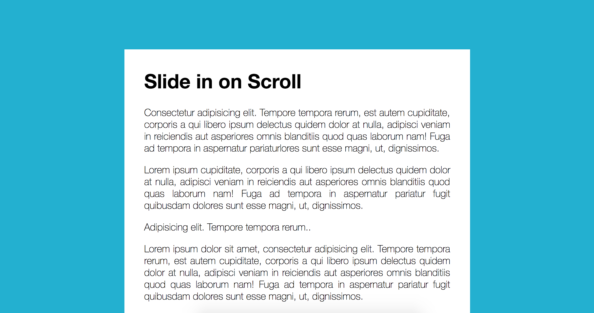
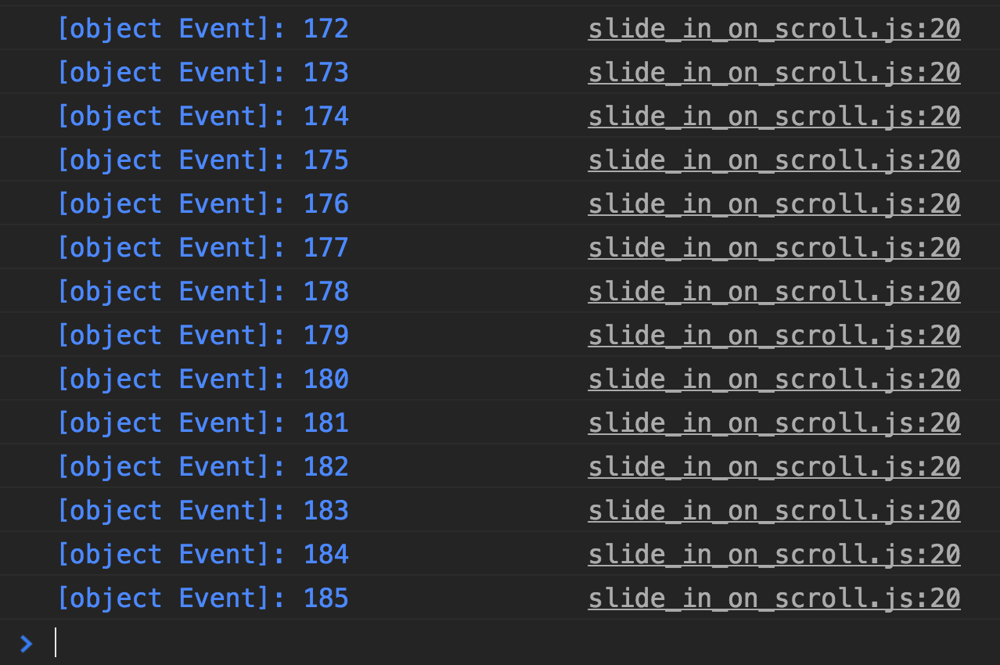

> This is a JavaScript practice with [JavaScript30](https://javascript30.com/) by [Wes Bos](https://github.com/wesbos) without any frameworks, no compilers, no boilerplate, and no libraries.

# 13 - Slide in on Scroll

`window.scrollY`, `window.innerHeight`, `offsetTop`



view demo [here](https://amelieyeh.github.io/JS30/13-Slide%20in%20on%20Scroll/index.html)

### Debouncing

use debounce function provided to avoid performance issue, just wrap the `checkSlide` function into the `debounce()` function

```
window.addEventListener('scroll', debounce(checkSlide));
```

if we don't do debounce, then it will too much like:



### Checking images

```
function checkSlide(e) {
  sliderImages.forEach(sliderImage => {

    // half way through the image
    const slideInAt = (window.scrollY + window.innerHeight) - sliderImage.height / 2;

    // bottom of the image
    const imageBottom = sliderImage.offsetTop + sliderImage.height;

    const isHalfShown = slideInAt > sliderImage.offsetTop;
    const isNotScrolledPast = window.scrollY < imageBottom;

    if(isHalfShown && isNotScrolledPast) {
      sliderImage.classList.add('active');
    } else {
      sliderImage.classList.remove('active');
    }
}
```

the `.offsetTop` tells the top of image is how far from the top of the actual window

