> This is a JavaScript practice with [JavaScript30](https://javascript30.com/) by [Wes Bos](https://github.com/wesbos) without any frameworks, no compilers, no boilerplate, and no libraries.

# 14 - Object and Arrays - Reference VS Copy

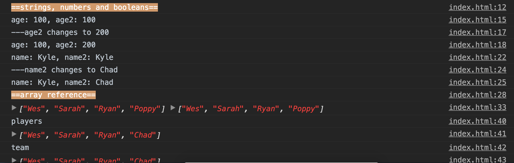

view demo [here](https://amelieyeh.github.io/JS30/14-JavaScript%20References%20VS%20Copying/index.html)

### Strings, Numbers and Booleans reference and copy

```
let age = 100;
let age2 = age;
age2 = 200;

let name = 'Kyle';
let name2 = name;
name2 = 'Chad';
```

it won't change the original one, does make sense

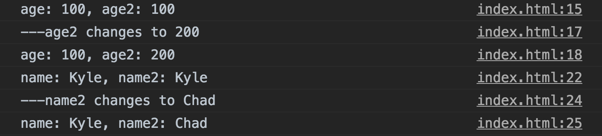

### Arrays reference and copy

```
let players = ['Wes', 'Sarah', 'Ryan', 'Poppy'];
const team = players;
```

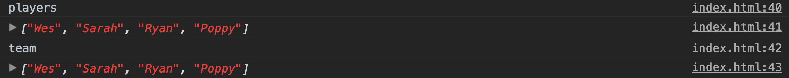

if we update the `team[3]`

```
team[3] = 'Chad';
```

that will also update the `players[3]` too, and that is not what we want

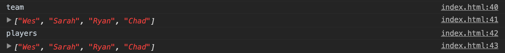

to fix it, we take a copy instead

```
const team2 = players.slice();
const team3 = [].concat(players); // same way as team2

team2[3] = "Chad";
team3[3] = "Chad";
```

so that it won't change the original one (players)

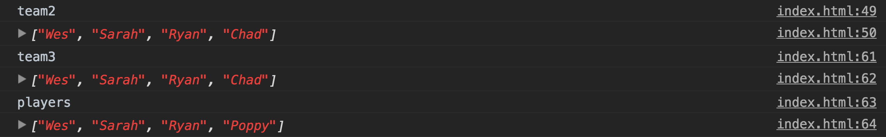

use ES6 spread syntax

```
const team4 = [...players];   // just like take a copy
team4[3] = "Hello Kitty~ Meow";
```

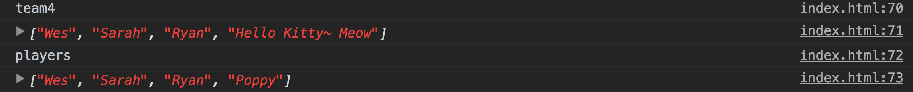

or you can use `Array.from()` as well

```
const team5 = Array.from(players);  // same as team4
team5[3] = "Hello Kitty~ Meow";
```

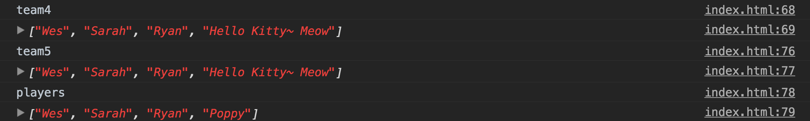

### Objects reference and copy

think we make a copy of `person` object and want to add `number` property to only `man` object

```
const person = {
  name: "Tom",
  age: 30
};

const man = person;
man.number = 100;
```

does it will also change the `person` object ?

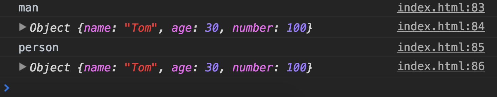

unfortunately ...yes, and that's not what we want

we can use [`Object.assign()`](https://developer.mozilla.org/en-US/docs/Web/JavaScript/Reference/Global_Objects/Object/assign) to fix this

- `Object.assign()`: first argument is an empty object (`{}`), second is the object (`person`) to fold in, third is the values we want to additionally fold in (`{ number: 100 }`), it difference between `slice()` and `splice()` in Arrays

```
const man2 = Object.assign({}, person, { number: 100 });
```

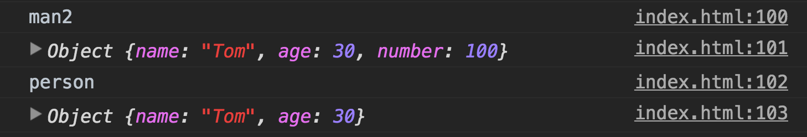

but there's a problem is the **`Object.assign()` only copy one level deep**... so if you try:

```
const tom = {
  name: 'Tom',
  age: 30,
  social: {
    twitter: '@tomyes',
    facebook: 'tomyes.coolman'
  }
};

const tom2 = Object.assign({}, tom);
tom2.social.twitter = '@tom2_nobody';
```

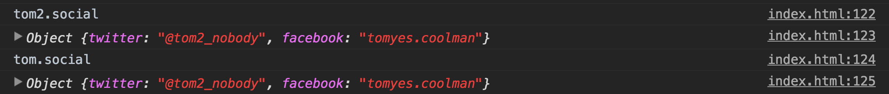

the `tom.social.twitter` is changed as well

if we need to get a clone deep (i.e. second level deep), we have to run a function and go online and find it where, it's called **clone deep** and that will clone every level as deep as you want. and before doing it, we might ask ourselves that is do we really need to do this?

there is some cheating way to do a clone deep by using `JSON.parse(JSON.stringify())`, just pass in the `tom` like:

```
const tom3 = JSON.parse(JSON.stringify(tom));
tom3.social.twitter = '@tom3_nobody';
```

so the `tom.social.twitter` won't be changed

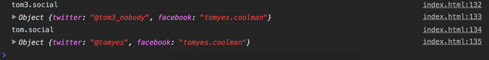

too see what's going on here, we can `console.log()`...

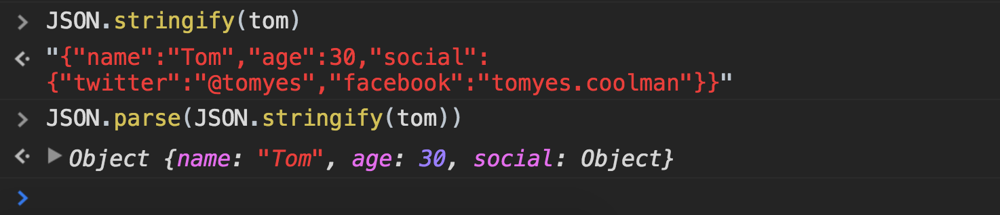

through the `JSON.stringify()` to turn the `tom` object into a `string` and then pass it to `JSON.parse()` to construct into an `object`

- THe [`JSON.stringify()`](https://developer.mozilla.org/en-US/docs/Web/JavaScript/Reference/Global_Objects/JSON/stringify) methods converts a JavaScript value to a JSON string

- The [`JSON.parse()`](https://developer.mozilla.org/en-US/docs/Web/JavaScript/Reference/Global_Objects/JSON/parse) method parses a JSON string, constructing the JavaScript value or object described by the string

