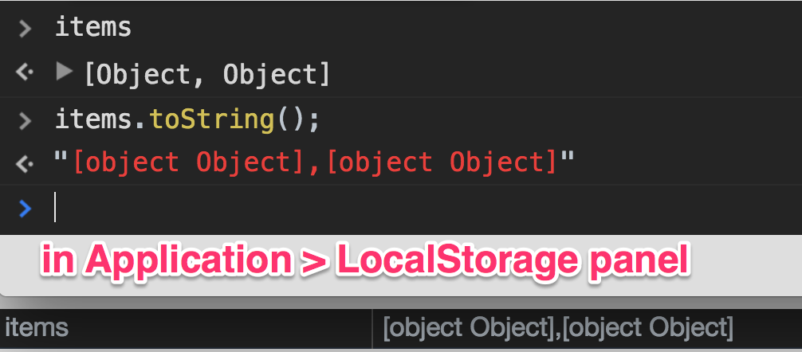
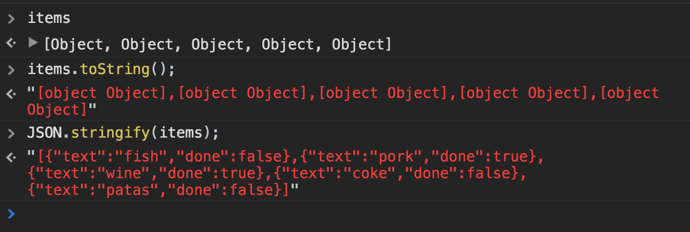

> This is a JavaScript practice with [JavaScript30](https://javascript30.com/) by [Wes Bos](https://github.com/wesbos) without any frameworks, no compilers, no boilerplate, and no libraries.

# 15 - LocalStorage and Event Delegation

`localStorage`, `e.preventDefault()`


view demo [here](https://amelieyeh.github.io/JS30/15-LocalStorage%20and%20Event%20Delegation/index.html)

### Take and load datas with localStorage

```
const addItems = document.querySelector('.add-items');
const itemsList = document.querySelector('.plates');
const items = JSON.parse(localStorage.getItem('items')) || [];
// const items = [];
```

`const items` is to check if there is something in `localStorage` and then we fall back to an empty array

- the [`localStorage`](https://developer.mozilla.org/en-US/docs/Web/API/Window/localStorage) property allows you to access a local Storage object

```
function addItem(e) {
  e.preventDefault();

  const item = {
    text: text,  // or in ES6 syntax: `text,`
    done: false
  };

  items.push(item);
  populateList(items, itemsList);
  // localStorage.setItem ('items', items);
  localStorage.setItem ('items', JSON.stringify(items));
  this.reset();
}
```

- [`e.preventDefault()`](https://developer.mozilla.org/en-US/docs/Web/API/Event/preventDefault) -> cancels the event if it is cancelable, without stopping further propagation of the event
- `items.push(item);` -> take `item` and put it into the `items` array
- `this.reset();` -> `this` is the `form`, `reset()` is the form method to clear the input

**[NOTICE]**

```
localStorage.setItem ('items', items);`
```

will just get `string` as return



that's because browser doesn't know how to handle it so it will use `toString()` method that exists on the number or the object (in this case is an array), therefore we need to do is to `JSON.stringify()` it before we convert like so

```
localStorage.setItem ('items', JSON.stringify(items));
```



### Update the view part

use `populateList()` this way is much more resilient than just reaching outside the items and grabbing them the place where we will dump them

- the `populateList()` needs two things:
  - a list of plates to populateList: `plates = []`
     - don't forget to set the default `plates` as an empty array(or object), otherwise it will break up the javascript sometimes (in this case the `plates` is an array)
  - a place to put the HTML: `plateList`

```
function populateList(plates = [], plateList) {
  plateList.innerHTML = plates.map((plate, i) => {
    return `
      <li>
        <input type="checkbox" data-index=${i} id="item${i}" ${plate.done ? 'checked' : ''}>
        <label for="item${i}">${plate.text}</label>
      </li>
    `
  }).join('');
}
```

here the `.join('')` takes the array (which is `places.map()` made) and turn into a string and then pass it to `innerHTML`

### Toggle the checked status

```
function toggleDone(e) {
  if(!e.target.matches('input')) return;

  const el = e.target;
  const index = el.dataset.index;

  items[index].done = !items[index].done;
  localStorage.setItem ('items', JSON.stringify(items))
  populateList(items, itemsList);
}
```

let's take look

- skip this unless it's an input

```
if(!e.target.matches('input')) return;
```

- flip-floping between true and false

```
items[index].done = !items[index].done;
```

- everytime update will mirror to the localStorage

```
localStorage.setItem ('items', JSON.stringify(items));
```

- update the actual visibility part on html

```
populateList(items, itemsList);
```

### Hook up events and update visibility part on page

```
addItems.addEventListener('submit', addItem);
itemsList.addEventListener('click', toggleDone);
populateList(items, itemsList);
```

### Extended thinking

everytime we create an item, it calls `populateList()` and rerendering the entire list again instead of just update one single line, in this case is OK on performance, but practically just update one single line by using React or other frameworks is more efficient and helpful

