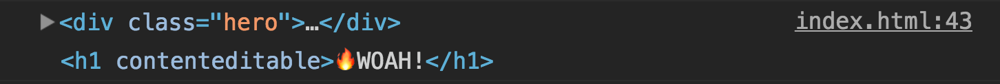
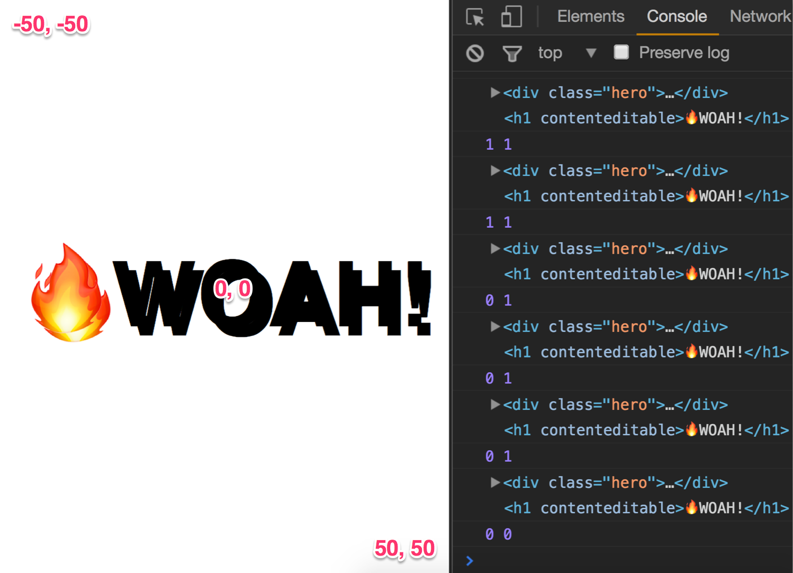

> This is a JavaScript practice with [JavaScript30](https://javascript30.com/) by [Wes Bos](https://github.com/wesbos) without any frameworks, no compilers, no boilerplate, and no libraries.

# 16 - CSS Text Shadow Mouse Move Effect


view demo [here](https://amelieyeh.github.io/JS30/16-Mouse%20Move%20Shadow/index.html)

### Grab elements and hook up mousemve event

our `mousemove` event hooked up on `hero` element, and we want to do text shadow effect on its text, right in the `h1` tag

```
const hero = document.querySelector('.hero');
const text = hero.querySelector('h1');

hero.addEventListener('mousemove', shadow);
```

### The shadow function

`walk` is defined to calculate the spacings between shadows, the value is more higher, the spacing is more bigger

```
const walk = 500;  // 500px
```

set the `width` and `height` of `hero`

in ES6 syntax

```
const { offsetWidth: width, offsetHeight: height } = hero;
let { offsetX: x, offsetY: y } = e;
```

above code equals in this way:

```
const width = hero.offsetWidth;
const height = hero.offsetHeight;
let x = e.offsetX;
let y = e.offsetY;
```

now we `console.log()` out will see that `this` is `.hero` and `e.target` is `h1`

```
console.log(this, e.target);
```



calculate offset positions

```
if(this !== e.target) {
  x = x + e.target.offsetLeft;
  y = y + e.target.offsetTop;
}

const xWalk = Math.round((x / width * walk) - (walk / 2));
const yWalk = Math.round((y / height * walk) - (walk / 2));
console.log(xWalk, yWalk);
```

log the `xWalk` and `yWalk` out to see the offsets after calculating



and the CSS part, add the `textShadow` effect

```
text.style.textShadow = `
  ${xWalk}px ${yWalk}px 0 rgba(255, 0, 255, 0.7),
  ${xWalk * -1}px ${yWalk}px 0 rgba(0, 255, 255, 0.6),
  ${yWalk}px ${xWalk * -1}px 0 rgba(0, 255, 0, 0.5),
  ${yWalk * -1}px ${xWalk}px 0 rgba(0, 0, 255, 0.4)
`;
```

### The concepts

- the [`offsetLeft`](https://developer.mozilla.org/en-US/docs/Web/API/HTMLElement/offsetLeft) read-only property returns the number of pixels that the **upper left** corner of the current element is offset to the left within the [`.offsetParent`](https://developer.mozilla.org/en-US/docs/Web/API/HTMLelement/offsetParent) node.

- the [`offsetTop`](https://developer.mozilla.org/en-US/docs/Web/API/HTMLElement/offsetTop) property read-only property returns the distance of the current element relative to the **top** of the [`offsetParent`](https://developer.mozilla.org/en-US/docs/Web/API/HTMLelement/offsetParent) node.

