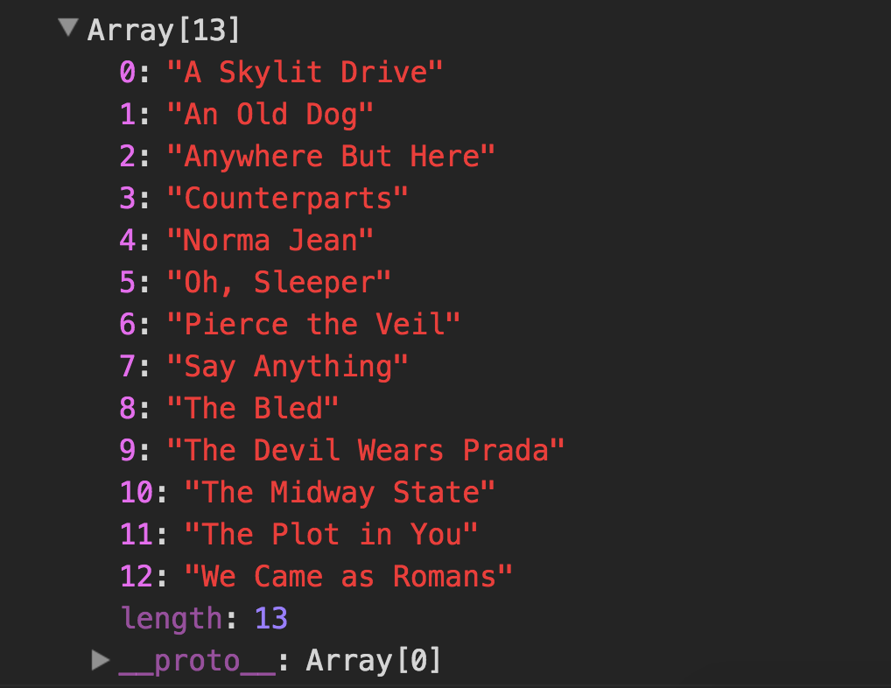
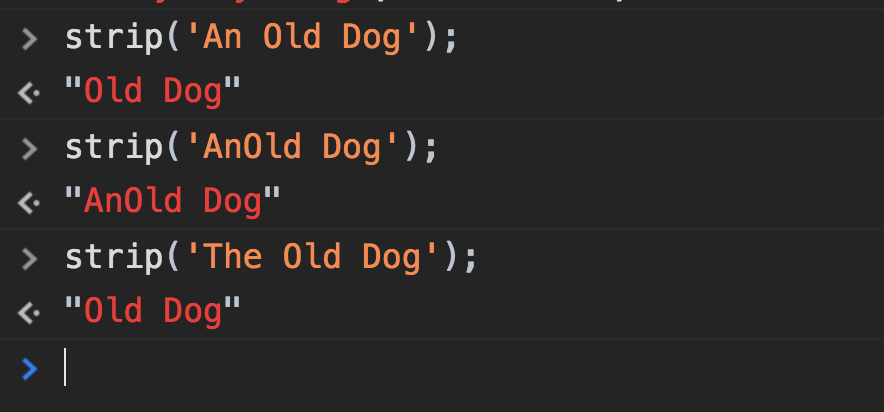
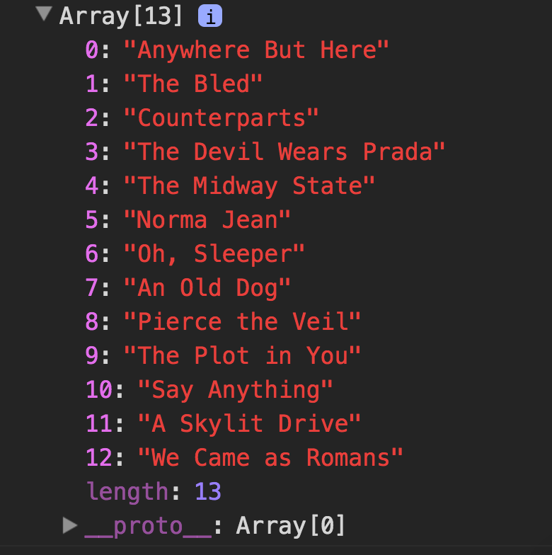
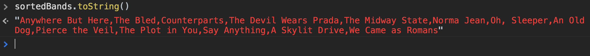
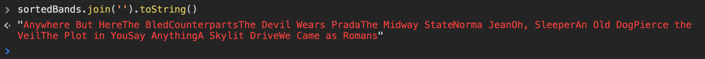

> This is a JavaScript practice with [JavaScript30](https://javascript30.com/) by [Wes Bos](https://github.com/wesbos) without any frameworks, no compilers, no boilerplate, and no libraries.

# 17 - Sorting Without Articles


view demo [here](https://amelieyeh.github.io/JS30/17-Sort%20Without%20Articles/index.html)

### Sort datas

write in just one hot line

```
const sortedBands = bands.sort((a, b) => strip(a) > strip(b) ? 1 : -1);
```

equals

```
if(strip(a) > strip(b)) {
  return 1;
} else {
  return -1;
}
```

by default, it will sort by alphabetical order



### Strip out the words that we don't want

to strip out the specified words which are not articles

```
function strip(bandName) {
  return bandName.replace(/^(a |the |an )/i, '').trim();
}
```
test it to see if it works



**[NOTICE]** we are only using `strip()` in if statement, and we are not actually going to be modify our data (it's not neccessary to do so)

then now it's sorted by alphabetical order after `strip()` the array



### Put them together

```
document.querySelector('#bands').innerHTML =
  sortedBands
    .map(band => `<li>${band}</li>`)
    .join('');
```

it takes the element and sets to the `innerHTML`, and that's going to return an array with commas (`,`) by default, so we want to `join('')` it into one big string rather than a bunch of string with with a comma in between

if without `join('')`:



so we need to 'join('')' to remove commas:



