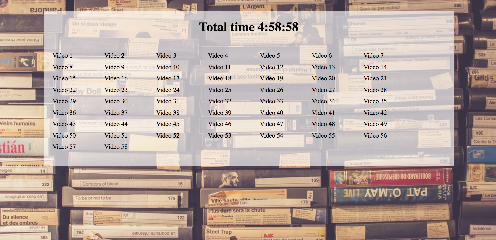
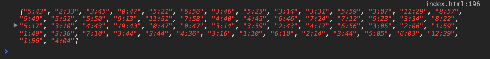
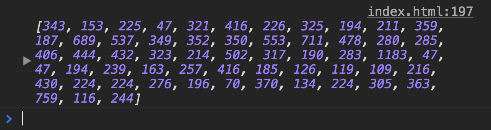
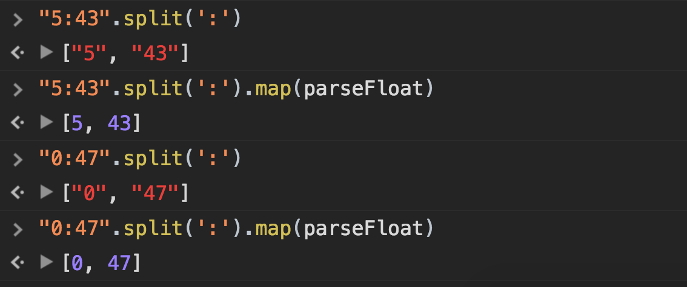
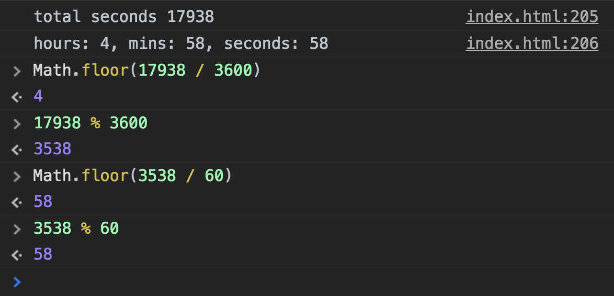

> This is a JavaScript practice with [JavaScript30](https://javascript30.com/) by [Wes Bos](https://github.com/wesbos) without any frameworks, no compilers, no boilerplate, and no libraries.

# 18 - Adding Up Times width Reduce



view demo [here](https://amelieyeh.github.io/JS30/18-Adding%20Up%20Times%20with%20Reduce/index.html)

### Grabing times

don't forget to turn the nodeList into an array

```
const timeNodes = Array.from(document.querySelectorAll('[data-time]'));
```

### Calcualting Times

get the `dataset.time`

```
const seconds = timeNodes
  .map(timeNode => timeNode.dataset.time)

console.log(seconds);
```

will be value of `data-time` attributes we set on html




then we turn the values to seconds unit, and use `parseFloat` to turn it to an actual number of array

```
const seconds = timeNodes
  .map(timeNode => timeNode.dataset.time)
  .map(timeCode => {
    const [mins, secs] = timeCode.split(':').map(parseFloat);
    return (mins * 60) + secs;
  })

console.log(seconds);
```



The [`parseFloat`](https://developer.mozilla.org/en-US/docs/Web/JavaScript/Reference/Global_Objects/parseFloat) function parses a string argument and returns a floating point number.



finally, let's `reduce` the array to get the total seconds

```
const seconds = timeNodes
  .map(timeNode => timeNode.dataset.time)
  .map(timeCode => {
    const [mins, secs] = timeCode.split(':').map(parseFloat);
    return (mins * 60) + secs;
  })
  .reduce((total, vidSeconds) => total + vidSeconds);    // total seconds 17938

console.log(seconds);
```

### Figure out the total time

use the `seconds` (total seconds) variable to calculate the `hours` and `mins`, use `Math.floor` to remove decimal point

```
let secondsLeft = seconds;
const hours = Math.floor(secondsLeft / 3600);
secondsLeft = secondsLeft % 3600;

const mins = Math.floor(secondsLeft / 60);
secondsLeft = secondsLeft % 60;
```


### Visual part

I add a `<h1>` tag to place the result total time

```
const totalTime = document.querySelector('.total');

totalTime.innerHTML = `<span>Total time <b>${hours}</b>:<b>${mins}</b>:<b>${secondsLeft}</span>`;
```

