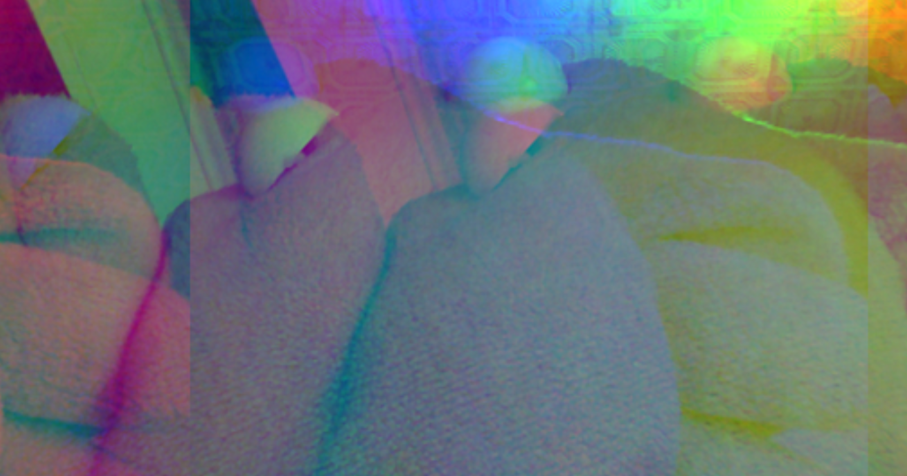
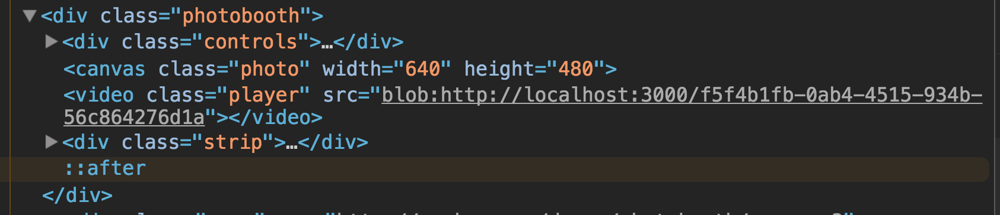

> This is a JavaScript practice with [JavaScript30](https://javascript30.com/) by [Wes Bos](https://github.com/wesbos) without any frameworks, no compilers, no boilerplate, and no libraries.

# 19 - Unreal Webcam Fun



view demo [here](https://amelieyeh.github.io/JS30/19-Webcam%20Fun/index.html)

for accessing our webcam which is must be tied to *secure origin* means that a website is `HTTPS`, and `localhost` in our tutorial is also a secure origin. we use `npm` (`npm install` & `npm start`) to run our small server to build the page.

### To `querySelector` elements we need

```
const video = document.querySelector('.player');
const canvas = document.querySelector('.photo');
const ctx = canvas.getContext('2d');
const strip = document.querySelector('.strip');
const snap = document.querySelector('.snap');
```

### The `getVideo()` function

first of all, we need to get the real video source

```
function getVideo() {
  navigator.mediaDevices.getUserMedia({ video: true, audio: false })
    .then(localMediaStream => {
      console.log(localMediaStream);
      video.src = window.URL.createObjectURL(localMediaStream);
      video.play();
    })
    .catch(err => {
      console.error(`OH NO!!!`, err);
    });
}

```

the `.catch` is to handle the error.

check out the HTML page and you will see that the `video`'s `src` is a `blob:http://XXX`. `blob` means a *raw data* being piped in off this webcam right on the page.



### The `paintToCanavas()` function

take a frame from video (on the upper-right corner), and to paint it onto the actual canvas right on the page

```
function paintToCanavas() {
  const width = video.videoWidth;
  const height = video.videoHeight;
  canvas.width = width;
  canvas.height = height;

  return setInterval(() => {
    ctx.drawImage(video, 0, 0, width, height);
    // take the pixels out
    let pixels = ctx.getImageData(0, 0, width, height);

    // try some effects
    // pixels = redEffect(pixels);

    pixels = rgbSplit(pixels);
    // ctx.globalAlpha = 0.8;

    // pixels = greenScreen(pixels);
    // put them back
    ctx.putImageData(pixels, 0, 0);
  }, 16);
}
```

make sure the canvas width and height equals webcam's width and height to properly rendering

```
const width = video.videoWidth;
const height = video.videoHeight;
canvas.width = width;
canvas.height = height;
```

### The `takePhoto()` function

```
function takePhoto() {
  // played the sound
  snap.currentTime = 0;
  snap.play();

  // take the data out of the canvas
  const data = canvas.toDataURL('image/jpeg');
  const link = document.createElement('a');
  link.href = data;
  link.setAttribute('download', 'snapshot');
  link.innerHTML = ``;
  strip.insertBefore(link, strip.firsChild);
}
```

finally, basic webcam just done!

```
getVideo();

video.addEventListener('canplay', paintToCanavas);
```

