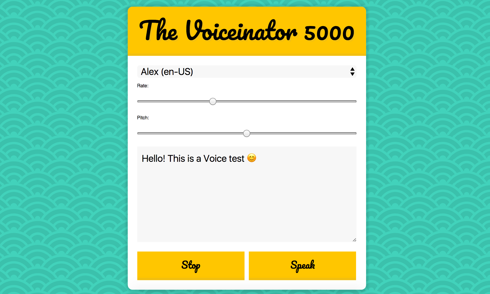
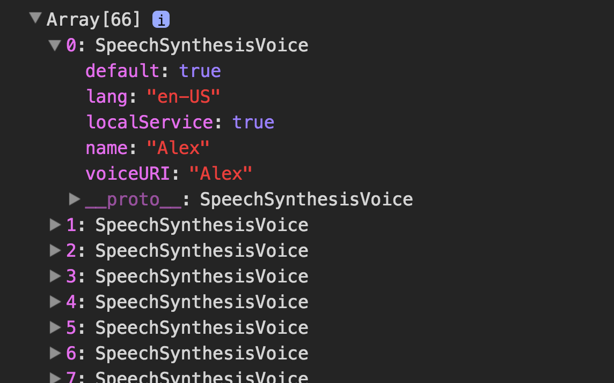

> This is a JavaScript practice with [JavaScript30](https://javascript30.com/) by [Wes Bos](https://github.com/wesbos) without any frameworks, no compilers, no boilerplate, and no libraries.

# 23 - Speech Synthesis



view demo [here](https://amelieyeh.github.io/JS30/23-Speech%20Synthesis/index.html)

### Set up elements

```
const msg = new SpeechSynthesisUtterance();
let voices = [];
const voicesDropdown = document.querySelector('[name="voice"]');
const options = document.querySelectorAll('[type="range"], [name="text"]');
const speakButton = document.querySelector('#speak');
const stopButton = document.querySelector('#stop');
msg.text = document.querySelector('[name="text"]').value;
```

### The `populateVoices()` function

```
function populateVoices() {
  voices = this.getVoices();  // get all the voices
  console.log(voices);

  // select dropdown
  voicesDropdown.innerHTML = voices
    // only want en ver. voices
    .filter(voice => voice.lang.includes('en'))
    .map(voice => `<option value="${voice.name}">${voice.name} (${voice.lang})</option>`)
    .join('');
}
```

- to `console.log(voices)` will get all the voice synthesis

```
voices = this.getVoices();
console.log(voices);
```



- for select dropdown

because we only want just english versions so we `filter` array with `includes()`

```
voicesDropdown.innerHTML = voices
  .filter(voice => voice.lang.includes('en'))
  .map(voice => `<option value="${voice.name}">${voice.name} (${voice.lang})</option>`)
  .join('');
```

### The `setVoice()` function

set the voice equals the value of select option

```
function setVoice() {
  msg.voice = voices.find(voice => voice.name === this.value);
  toggle();
}
```

### The `toggle()` function

change voice while talking, and don't forget to call this function in `setVoice()` and `setOption()`

```
function toggle(startOver = true) {
  speechSynthesis.cancel();
  if (startOver) {
    speechSynthesis.speak(msg);
  }
}
```

### The `setOption()` function

change the value of `Rate`, `Pitch` options and `textarea`

```
function setOption() {
  console.log(this.name, this.value);
  msg[this.name] = this.value;
  toggle();
}
```

### Hook up events

```
speechSynthesis.addEventListener('voiceschanged', populateVoices);
voicesDropdown.addEventListener('change', setVoice);
options.forEach(option => option.addEventListener('change', setOption));
speakButton.addEventListener('click', toggle);
stopButton.addEventListener('click', () => toggle(false));
```

