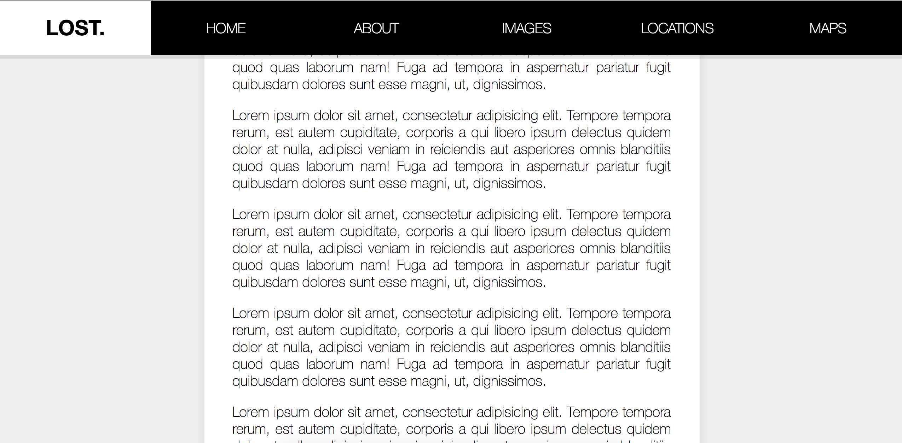

> This is a JavaScript practice with [JavaScript30](https://javascript30.com/) by [Wes Bos](https://github.com/wesbos) without any frameworks, no compilers, no boilerplate, and no libraries.

# 24 - Sticky Nav



view demo [here](https://amelieyeh.github.io/JS30/24-Sticky%20Nav/index.html)

### Get the position of nav

get nav's top position related to the top of window

```
const nav = document.querySelector('#main');
const topOfNav = nav.offsetTop;  // 320
```

### The `fixNav()` function

```
function fixNav() {
  if (window.scrollY >= topOfNav) {
    document.body.style.paddingTop = nav.offsetHeight + 'px';  // 77px (nav's height)
    document.body.classList.add('fixed-nav');
  } else {
    document.body.style.paddingTop = 0;
    document.body.classList.remove('fixed-nav');
  }
}

window.addEventListener('scroll', fixNav);
```

