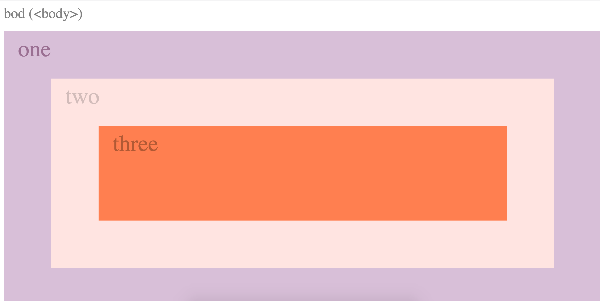
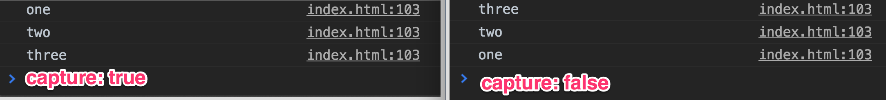
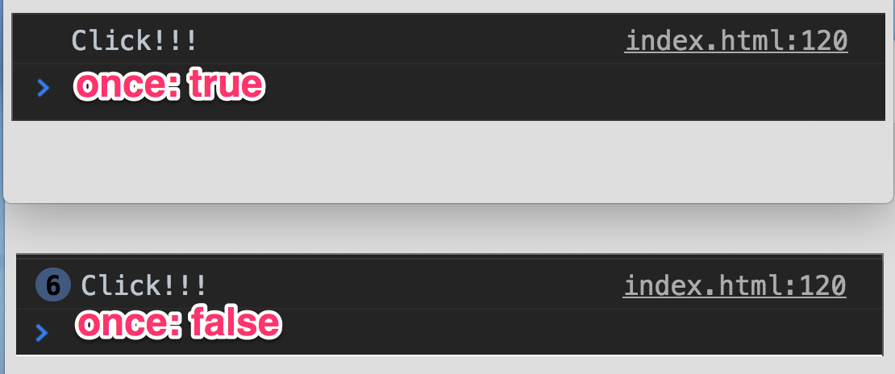

> This is a JavaScript practice with [JavaScript30](https://javascript30.com/) by [Wes Bos](https://github.com/wesbos) without any frameworks, no compilers, no boilerplate, and no libraries.

# 25 - Event Capture, Propagation, Bubbling and Once



view demo [here](https://amelieyeh.github.io/JS30/25-Event%20Capture,%20Propagation,%20Bubbling%20and%20Once/index.html)

`e.stopPropagation()`, `capture`, `once`

### The `event.stopPropagation()`

The [`event.stopPropagation()`](https://developer.mozilla.org/en-US/docs/Web/API/Event/stopPropagation) prevents further propagation of the current event in the capturing and bubbling phases.

To bubble up which means that it's triggering that events as you go up, so use `e.stopPropagation();` to stop bubbling that event up.

```
function logText(e) {
  console.log(this.classList.value);
  e.stopPropagation();
}

document.body.addEventListener('click', logText);
divs.forEach(div => div.addEventListener('click', logText));
```

- if we don't set `e.stopPropagation();` and `console.log(this.classList.value);` will get when we click on just the "three" `<div>`


### The `capture` and `once`

refernce: [here -> EventTarget.addEventListener()](https://developer.mozilla.org/en-US/docs/Web/API/EventTarget/addEventListener)

##### `capture`

`capture` is a boolean that indicates that events of this type will be dispatched to the registered listener before being dispatched to any EventTarget beneath it in the DOM tree.

```
function logText(e) {
  console.log(this.classList.value);
}

divs.forEach(div => div.addEventListener('click', logText, {
  capture: false
}));
```

- set `capture` is `true` or `false` **without** setting `e.stopPropagation();`



##### `once`

`once` is a boolean indicating that the listener should be invoked at most once after being added. **If it is true, the listener would be removed automatically when it is invoked**.

```
button.addEventListener('click', () => {
  console.log('Click!!!');
}, {
  once: false
});
```

- set `once` is `ture` or `false` and click **multiple** times



