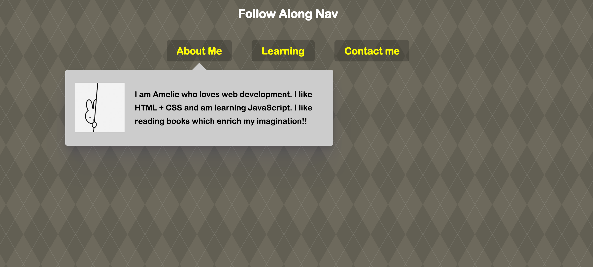

> This is a JavaScript practice with [JavaScript30](https://javascript30.com/) by [Wes Bos](https://github.com/wesbos) without any frameworks, no compilers, no boilerplate, and no libraries.

# 26 - Stripe Follow Along Dropdown



view demo [here](https://amelieyeh.github.io/JS30/26-Stripe%20Follow%20Along%20Nav/index.html)

### The `handleEnter()` function

```
function handleEnter() {
  this.classList.add('trigger-enter');
  setTimeout(() => this.classList.contains('trigger-enter') && this.classList.add('trigger-enter-active'), 150);

  background.classList.add('open');

  const dropdown = this.querySelector('.dropdown');
  const dropdownCoords = dropdown.getBoundingClientRect();
  const navCoords = nav.getBoundingClientRect();

  const coords = {
    height: dropdownCoords.height,
    width: dropdownCoords.width,
    top: dropdownCoords.top - navCoords.top,
    left: dropdownCoords.left - navCoords.left
  };

  background.style.setProperty('width', `${coords.width}px`);
  background.style.setProperty('height', `${coords.height}px`);
  background.style.setProperty('transform', `translate(${coords.left}px, ${coords.top}px)`);
}
```

- the `setTimeout()` here is if has `trigger-enter` class and it equals true then will excute `this.classList.add('trigger-enter-active')` , it will prevent the weird `trigger-enter-active` when you hover quickly between li items

```
setTimeout(() => this.classList.contains('trigger-enter') && this.classList.add('trigger-enter-active'), 150);
```

above code use ES6 arrow function to properly inherit from it's parent instead, otherwise `this` will be the `window` and will throut an error

- figure out the nav's position as a initial coords
```
const navCoords = nav.getBoundingClientRect();
```
- to prevent wrong position when the nav has be pushed down or moved offset on X-asis, so `- navCoords.`top/left

```
top: dropdownCoords.top - navCoords.top,
left: dropdownCoords.left - navCoords.left
```

### The `handleLeave()` function

```
function handleLeave() {
  this.classList.remove('trigger-enter', 'trigger-enter-active');
  background.classList.remove('open');
}
```

### Hook up events

```
triggers.forEach(trigger => trigger.addEventListener('mouseenter', handleEnter));
triggers.forEach(trigger => trigger.addEventListener('mouseleave', handleLeave));
```

