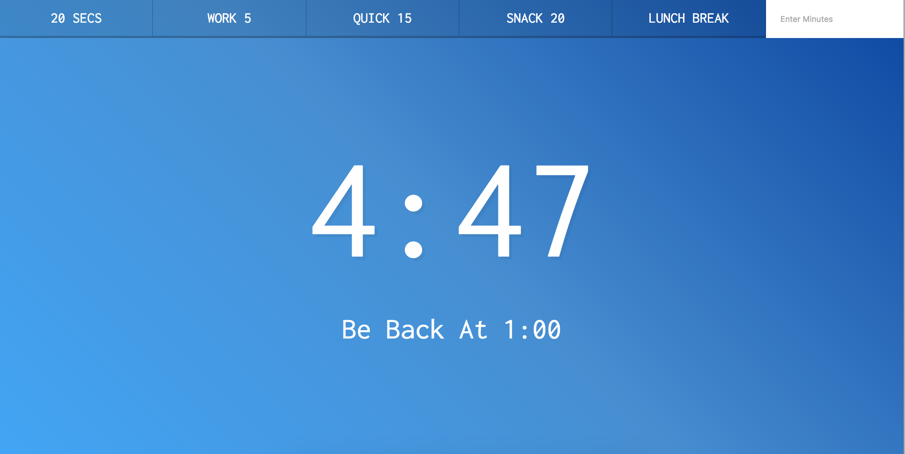
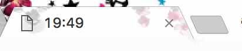

> This is a JavaScript practice with [JavaScript30](https://javascript30.com/) by [Wes Bos](https://github.com/wesbos) without any frameworks, no compilers, no boilerplate, and no libraries.

# 29 - Countdown Timer



view demo [here](https://amelieyeh.github.io/JS30/29-Countdown%20Timer/index.html)

### The `timer()` function

```
let countdown;
const timerDisplay = document.querySelector('.display__time-left');
const endTime = document.querySelector('.display__end-time');
const buttons = document.querySelectorAll('[data-time]');
```

```
function timer(seconds) {
  clearInterval(countdown);

  const now = Date.now();
  const then = now + seconds * 1000;

  displayTimeLeft(seconds);
  displayEndTime(then);

  countdown = setInterval(() => {
    const secondsLeft = Math.round((then - Date.now()) / 1000);

    // check if we should stop it
    if (secondsLeft < 0) {
      clearInterval(countdown);
      return;
    }

    // display it
    // console.log(secondsLeft);
    displayTimeLeft(secondsLeft);
  }, 1000);
}
```

- `clearInterval(countdown);`: when start a timer, clear existing timers, and it always **needs a variable name of a `setInterval()`** to stop it.
- remember to `clearInterval()` the timer at the **beginning** of the timer function.
- `const now = Date.now();`: will get us current `timestamp` in milliseconds
- `const then = now + seconds * 1000;`: `now` plus the number of seconds that you wish to run the timer for. `now` is in milliseconds, but `seconds` is not, so we need to multiple by 1000 to be in milliseconds as well

```
countdown = setInterval(() => {
  const secondsLeft = Math.round((then - Date.now()) / 1000);
  // check if we should stop it
  if (secondsLeft < 0) {
    clearInterval(countdown);
    return;
  }

  // display it
  displayTimeLeft(secondsLeft);
}, 1000);
```

- `setInterval()` does not run immediately, it needs 1 second to start

- **[NOTICE]** we can't use like:

```
setInterval(seconds, {
  seconds—;
});
```

because sometimes when the browser is not active, it might pause the `setInterval()`, and also pauses while scrolling in iOS.

### The `displayTimeLeft()` function

```
function displayTimeLeft(seconds) {
  const minutes = Math.floor(seconds / 60);
  const remainderSeconds = seconds % 60;
  const display = `${minutes}:${remainderSeconds < 10 ? '0' : ''}${remainderSeconds}`;

  document.title = display;
  timerDisplay.textContent = display;
}
```

- use `textContent` over `innerText`. `innerText` is IE specific and does not cover all elements
- `document.title = display;`: `document.title` can be dynamically set in JS, it updates the title of the webpage(the `<title>` tag on HTML) like:



### The `displayEndTime()` function

```
function displayEndTime(timestamp) {
  const end = new Date(timestamp);
  const hour = end.getHours();
  const adjustedHour = hour > 12 ? hour - 12 : hour;
  const minutes = end.getMinutes();
  endTime.textContent = `Be Back At ${adjustedHour}:${minutes < 10 ? '0' : ''}${minutes}`;
}
```

- `const adjustedHour = hour > 12 ? hour - 12 : hour;`: adjust the time format as in 12-hours instead of 24-hours

### The `startTimer()` function

```
function startTimer() {
  const seconds = parseInt(this.dataset.time);
  timer(seconds);
}
```

- `const seconds = parseInt(this.dataset.time);`: change the value of `data-time` attribute (`dataset`) of an element into a real number (say from `"20"` into `20`) by `parseInt()`

### Hook up events

```
buttons.forEach(button => button.addEventListener('click', startTimer));

document.customForm.addEventListener('submit', function(e) {
  e.preventDefault();
  const mins = this.minutes.value;
  timer(mins * 60);
  this.reset();  // clear form input value
});
```

- **[NOTICE]** we can directly select as `document.elementName` if an element has a `name attribute` in the DOM of HTML (in this case is `document.customForm`, the `customForm` is a `name attribute` of `<form>` element)
- `this.reset();`: clear form input value (`this` is the `form`)

