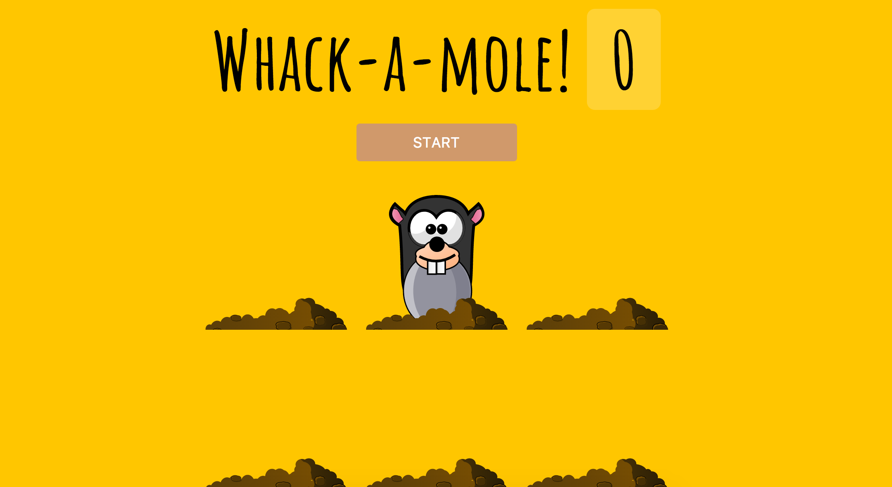

> This is a JavaScript practice with [JavaScript30](https://javascript30.com/) by [Wes Bos](https://github.com/wesbos) without any frameworks, no compilers, no boilerplate, and no libraries.

# 30 - Whack A Mole



view demo [here](https://amelieyeh.github.io/JS30/30-Whack%20A%20Mole/index.html)

### Set up things

```
const holes = document.querySelectorAll('.hole');
const scoreBoard = document.querySelector('.score');
const moles = document.querySelectorAll('.mole');

let lastHole;
let timeUp = false;
let score = 0;
```

### The `randomTime()` function

```
function randomTime(min, max) {
  return Math.round(Math.random() * (max - min) + min);
}
```

The [`Math.random(min, max)`](https://developer.mozilla.org/en-US/docs/Web/JavaScript/Reference/Global_Objects/Math/random) function returns a floating-point, pseudo-random number in the range (0, 1) that is, from 0 (inclusive) up to but not including 1 (exclusive), which you can then scale to your desired range.

- the final `+ min` ensures that the minimum possible value if the difference between max and min is 0, will be the min value itself, so it basically offsets the value of max-min by the value of min itself, then we can get a valid number.

### The `randomHole(holes)` function

```
function randomHole(holes) {
  const idx = Math.floor(Math.random() * holes.length);
  const hole = holes[idx];
  if (hole === lastHole) {
    console.log("Ah that is the same one bud");
    return randomHole(holes);
  }

  lastHole = hole;
  return hole;
}
```

- randomly defines the hole to pop up mole.
- if the `hole === lastHole` then re-execute the function again

```
if (hole === lastHole) {
  console.log("Ah that is the same one bud");
  return randomHole(holes);
}

lastHole = hole;
```

### The `peep()` function

```
function peep() {
  const time = randomTime(200, 1000);
  const hole = randomHole(holes);
  hole.classList.add('up');

  setTimeout(() => {
    hole.classList.remove('up');
    if(!timeUp) peep();
  }, time);
}
```

- `setTimeout()` to remove the `up` class if time up, otherwise keep `peep()`ing

### The `startGame()` function

on HTML

```
<button onClick="startGame()">START</button>
```

```
function startGame() {
  scoreBoard.textContent = 0;
  timeUp = false; // in case page reload
  score = 0;
  peep();

  setTimeout(() => timeUp = true, 10000);
}
```

- define the game time which is 10 secs and set the `timeUp = true`

### The `bonk(e)` function

```
function bonk(e) {
  if(!e.isTrusted) return; // cheater
  score ++;
  this.classList.remove('up');
  scoreBoard.textContent = score;
}

moles.forEach(mole => mole.addEventListener('click', bonk));
```

- `e.isTrusted` property which can check for fake clicks generated by javascript, in our game we need it to be `true` so that this actually came from the user's mouse input

